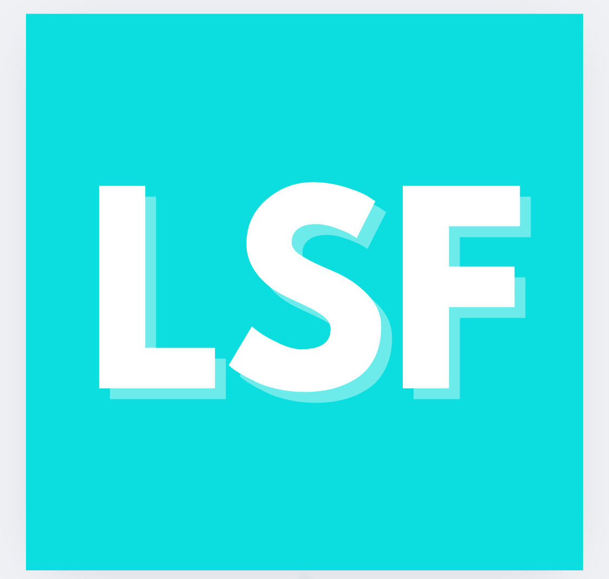

# Listening in/to South Florida

## Live Links

Site: https://rm4-25.github.io/lsf_3/

Submit Sound: https://rm4-25.github.io/lsf_3/Submit%20Sound/

LSF Team: https://rm4-25.github.io/lsf_3/LSF%20Team/

Data Reference Sheet (interactive map): https://docs.google.com/spreadsheets/d/1iRgb5LshDi4ApRCmCqpEZ2522XGPIGbaQgDXQxtLp1I/edit?usp=sharing

Data Reference Sheet (story map): https://docs.google.com/spreadsheets/d/1FKbyvrXn7gXpkGwB_lBMwZP2oQ7Bu5Kum5MF80HFeyw/edit?gid=0#gid=0 

## About the Project

This project aims to create an immersive soundscape experience that connects listeners to South Florida’s unique blend of natural and urban environments. By curating an archive of ambient sounds — from warbling birds in metro stations to the hum of beachfront waves and urban construction — the project invites participants to reflect on the fluid boundaries between the wild and the built world.

Through this digital experience, the project encourages both South Florida residents and non-locals to reimagine their relationship with the region’s landscapes. Listeners are invited to slow down, meditate on their surroundings, and reflect on the interplay of human and non-human forces that shape this dynamic environment. By amplifying the often-overlooked sonic details of everyday spaces, the project promotes a deeper understanding of the ecosystems, cultures, and infrastructures that define South Florida.

Ultimately, this initiative aims to foster environmental awareness, inspire community engagement, and offer a reflective pause amid the fast-paced digital world — creating a space where listeners can hear not only what is present, but also what may be unheard or unsilenced in the evolving South Florida landscape.

## Licensing

All Listening in/to South Florida media (pictures, sounds, and content) is licensed through <a href="https://creativecommons.org/licenses/by-nc-sa/4.0/?ref=chooser-v1" target="_blank" rel="license noopener noreferrer" style="display:inline-block;">CC BY-NC-SA 4.0</a>

The "Ed" Jekyll theme is under an <a href="https://www.mit.edu/~amini/LICENSE.md">MIT license</a>. 

Leaflet is an open source browser software plug-in licensed under [BSD-2 Clause License](https://github.com/rm4-25/lsf_3/blob/main/assets/BSD%202-Clause%20License.md).  
